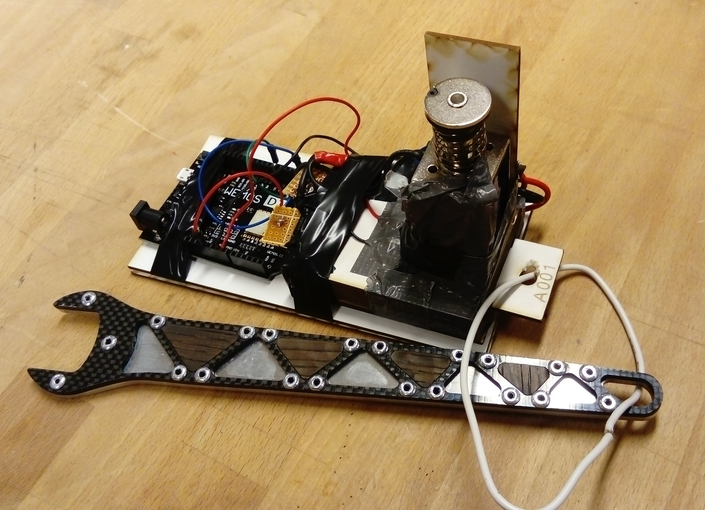
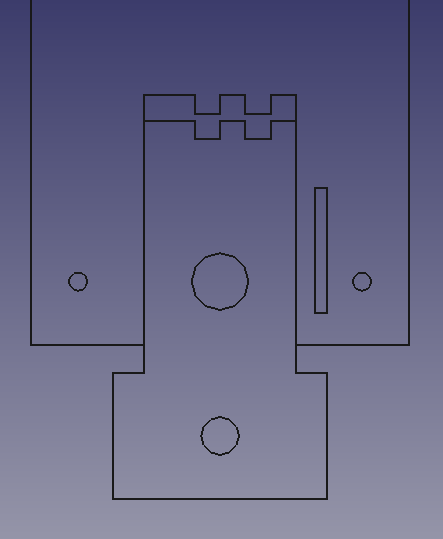
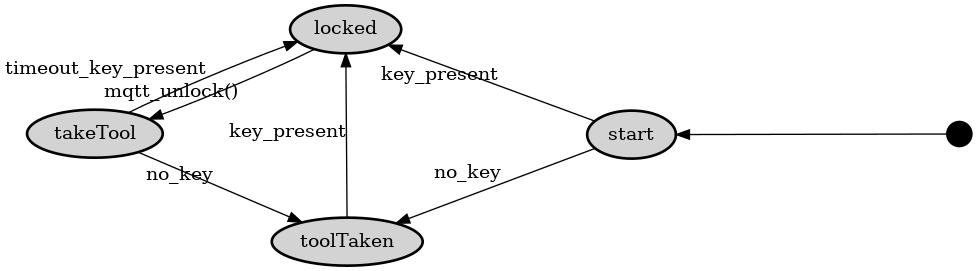
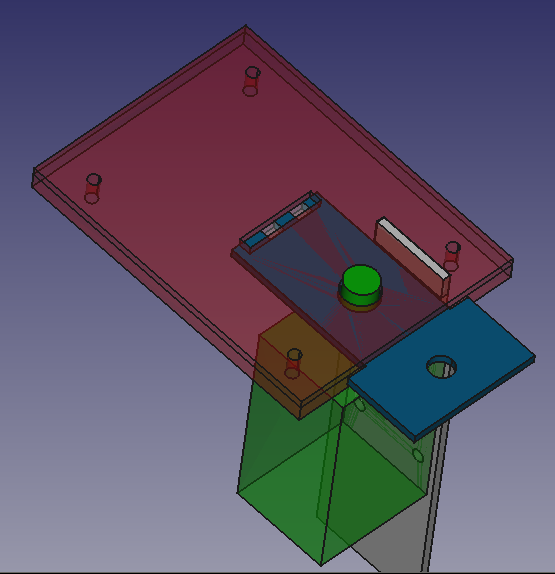

# TheLock
Electronic lock connected via wireless (Wi-Fi) and MQTT using [MsgFlo](https://msgflo.org).
The lock is intended to enforce 'checking out' and 'checking in' portable tools in a shared workshop environment.

It makes it possible to:

* Know whether a tool is currently in its station
* Checking for neccesary safety course before allowing usage
* Holding people responsible when equipment is not get returned or broken

Each lock has a key with a matching key pattern. The key is physically attached to the tool using a wire.
An optical sensor detects that the right key is used. IR leds normally light through, only a matching key will fully block light.

The key and lock can be CNC-milled, lasercut or 3d-printed.

## Status
**Proof of concept**

* July 2017: Functional prototype was built during 2-day hackathon
* First production version planned for October 2017

## Bill of Materials

[Google Doc](https://docs.google.com/spreadsheets/d/1zNnj4h8AQoaYpxoNCeb7HHqZF6n6yWtV7tDY7eSM0z4/edit?usp=sharing)

* Microcontroller - ESP8266 or similar. We used a Wemos D1 board.
* actuator - we used a solenoid that is rated for 12V (it actually actuates at about 7V, but slowly), it draws about 0.3 - 0.7 A. Alternatives:
[1](https://www.banggood.com/12V-24V-Electronic-Door-Lock-Rfid-Access-Control-for-Cabinet-Drawer-p-1011146.html)
[2](https://www.banggood.com/12V-DC-Cabinet-Door-Drawer-Electric-Lock-Assembly-Solenoid-Lock-27x29x18mm-p-1048590.html)
* mosfet - we used a IPP055N03L
* resistor - a 10k ohm resistor for pulldown on the control signal
* power supply - a 12V DC power supply for the actuator / solenoid
* IR led 0805, 120deg. [Kingbright kp-2012f3c](http://no.farnell.com/kingbright/kp-2012f3c/led-ir-0805-940nm/dp/2290432)
* IR phototransistor 0805, 120 deg. [Kingbright kp-2012p3c](http://no.farnell.com/kingbright/kp-2012p3c/phototransistor-0805-940nm/dp/2290434)

## Setup firmware

* Install Arduino libraries [PubsubClient](https://github.com/knolleary/pubsubclient) and [Msgflo](https://github.com/msgflo/msgflo-arduino)
* Setup wifi connection: Add a file `Config.h` defining parameters `WIFI_SSID` and `WIFI_PASSWORD`
* Configure MQTT details in the sketch

## TODO

v1.0: First fabricated version

* Electronics: Design PCB(s), millable
* Mechanics: Complete lock module.
Need way to attach PCB(s).
* Tools/Mechanics: Write script(s) for generating key/lock geometry for a whole series, incl names.
* Mechanics: Add a casing/box for 4-8 locks. Securely wall/table mountable.

Maybe

* Include a LED to show taken/not-state. Light when tool is there, or not?

## License
MIT

## Made by

[einsmein](https://github.com/einsmein), [tingox](https://github.com/tingox) and [jonnor](https://github.com/jonnor)

## State machine

## Electronics

Developed in KiCAD.

## Mechanics

Developed in FreeCAD.

SIG: gnd+in
PWR: 12v+gnd
OUT: 12v+out

IN
GND
12v
12v
OUT

