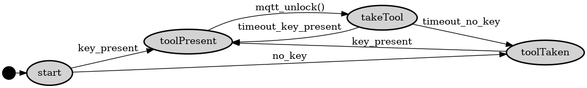

# TheLock
Electronic lock connected via wireless (Wi-Fi) and MQTT using [MsgFlo](https://msgflo.org).
The lock is intended to enforce 'checking out' and 'checking in' portable tools in a shared workshop environment.

It makes it possible to:

* Know whether a tool is currently in its station
* Checking for neccesary safety course before allowing usage
* Holding people responsible when equipment is not get returned or broken

Each lock has a key with a matching key pattern. The key is physically attached to the tool using a wire.
An optical sensor detects that the right key is used.
The key and lock can be CNC-milled, lasercut or 3d-printed.

## State
**Proof of concept**

* First functional prototype was built during 2-day hackathon

## Things needed
* Microcontroller - ESP8266 or similar. We used a Wemos D1 board.
* actuator - we used a solenoid that is rated for 12V (it actually actuates at about 7V, but slowly), it draws about 0.3 - 0.7 A. Alternatives:
[1](https://www.banggood.com/12V-24V-Electronic-Door-Lock-Rfid-Access-Control-for-Cabinet-Drawer-p-1011146.html)
[2](https://www.banggood.com/12V-DC-Cabinet-Door-Drawer-Electric-Lock-Assembly-Solenoid-Lock-27x29x18mm-p-1048590.html)
* mosfet - we used a IPP055N03L
* resistor - a 10k ohm resistor for pulldown on the control signal
* power supply - a 12V DC power supply for the actuator / solenoid
* IR led 0805, 120deg. [Kingbright kp-2012f3c](http://no.farnell.com/kingbright/kp-2012f3c/led-ir-0805-940nm/dp/2290432)
* IR phototransistor 0805, 120 deg. [Kingbright kp-2012p3c](http://no.farnell.com/kingbright/kp-2012p3c/phototransistor-0805-940nm/dp/2290434)

## Setup firmware

* Install Arduino libraries [PubsubClient](https://github.com/knolleary/pubsubclient) and [Msgflo](https://github.com/msgflo/msgflo-arduino)
* Setup wifi connection: Add a file `Config.h` defining parameters `WIFI_SSID` and `WIFI_PASSWORD`
* Configure MQTT details in the sketch

## TODO

* Purchase proper cabinet lock solenoids
* Support for multiple locks on one board (4-8 pcs)
* Design a PCB for the electronics
* Software: Send state changes out on MQTT
* Update design to new components
* Write tool for generating key/lock geometry for whole series 
* Fabricate first production version

## License
MIT

## State machine

## Electronics

